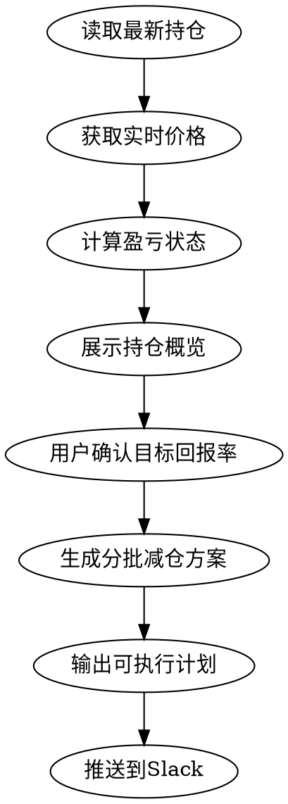

# 清仓策略分析

## Overview

读取当前持仓，结合实时价格和成本价，为短线投资者设计分批减仓至清仓的策略。核心：设定回报率目标 → 分批减仓计划 → 输出可执行方案。

## When to Use

- 用户要求分析持仓并制定清仓/退出策略
- 用户要求设计分批减仓计划
- 用户要求设定目标回报率后规划卖出
- 关键词：清仓、减仓、退出、止盈、分批卖出

## 执行流程



## 数据获取

```python
from app.models.position import Position
from app.services.position import PositionService
from app.services.unified_stock_data import UnifiedStockDataService

# 1. 获取最新持仓日期
latest_date = PositionService.get_latest_date()

# 2. 获取持仓快照
positions = PositionService.get_snapshot(latest_date)

# 3. 获取实时价格
stock_codes = [p.stock_code for p in positions]
unified = UnifiedStockDataService()
prices = unified.get_realtime_prices(stock_codes)

# 4. 每个持仓的关键数据
for p in positions:
    cost = p.cost_price          # 成本价 = total_amount / quantity
    qty = p.quantity             # 持有数量
    total_cost = p.total_amount  # 总成本
    current = prices.get(p.stock_code, {}).get('price', p.current_price)
    profit_pct = (current - cost) / cost * 100  # 当前盈亏%
```

## 分批减仓策略设计

### 默认参数（短线投资者）

| 参数 | 默认值 | 说明 |
|------|--------|------|
| 目标回报率 | 5-10% | 用户可自定义 |
| 减仓批次 | 3批 | 建议2-4批 |
| 每批比例 | 40/30/30 或 50/30/20 | 递减式 |
| 止损线 | -5% | 亏损超此值建议一次性清仓 |

### 策略分类

**盈利持仓**（当前价 > 成本价）：
- 已达目标：建议立即减仓第一批（40-50%），剩余设阶梯止盈
- 接近目标：设触发价位，到价减仓
- 小幅盈利：持有观察，设保本止损

**亏损持仓**（当前价 < 成本价）：
- 小幅亏损（<3%）：可等待反弹至成本价附近清仓
- 中等亏损（3-8%）：建议分2批减仓止损
- 深度亏损（>8%）：建议一次性清仓止损

### 输出格式

为每只股票输出：

```
## [股票名称] (代码)
- 成本价: ¥XX.XX | 现价: ¥XX.XX | 盈亏: +X.XX%
- 持有: XXX股 | 市值: ¥XX,XXX

清仓计划:
  第1批: 卖出 XX股 (40%) @ ¥XX.XX (目标价/现价)
  第2批: 卖出 XX股 (30%) @ ¥XX.XX (目标+2%)
  第3批: 卖出 XX股 (30%) @ ¥XX.XX (目标+4%)
  止损价: ¥XX.XX (-5%)
```

## 交互要点

1. **先展示持仓全貌**：列出所有持仓的盈亏状态，让用户看到整体情况
2. **确认目标回报率**：询问用户期望的回报率，默认建议5-10%
3. **区分对待**：盈利/亏损/深套分别给出不同策略
4. **量化到具体股数和价格**：不要给模糊建议，给出精确的卖出股数和目标价
5. **考虑最小交易单位**：A股最小100股（1手），卖出数量需为100的倍数

## Slack 推送

分析完成后，将清仓方案推送到 `news_operation` 频道：

```python
from app.services.notification import NotificationService
from app.config.notification_config import CHANNEL_OPERATION

# 构建推送消息（纯文本，Slack mrkdwn格式）
msg = "*📋 清仓策略分析*\n\n"
for stock in analyzed_stocks:
    msg += f"*{stock['name']}* ({stock['code']})\n"
    msg += f"成本: ¥{stock['cost']:.2f} | 现价: ¥{stock['price']:.2f} | 盈亏: {stock['pnl_pct']:+.2f}%\n"
    for batch in stock['batches']:
        msg += f"  第{batch['n']}批: {batch['qty']}股 @ ¥{batch['target']:.2f}\n"
    msg += f"  止损: ¥{stock['stop_loss']:.2f}\n\n"

NotificationService.send_slack(msg, CHANNEL_OPERATION)
```

推送时机：用户确认方案后自动推送，无需二次确认。

## Common Mistakes

- 忽略A股100股最小交易单位限制
- 对深度亏损股仍建议分批减仓（应果断止损）
- 未考虑股票所在市场（A股/美股/港股交易规则不同）
- 目标价设置不合理（脱离技术面支撑阻力位）
