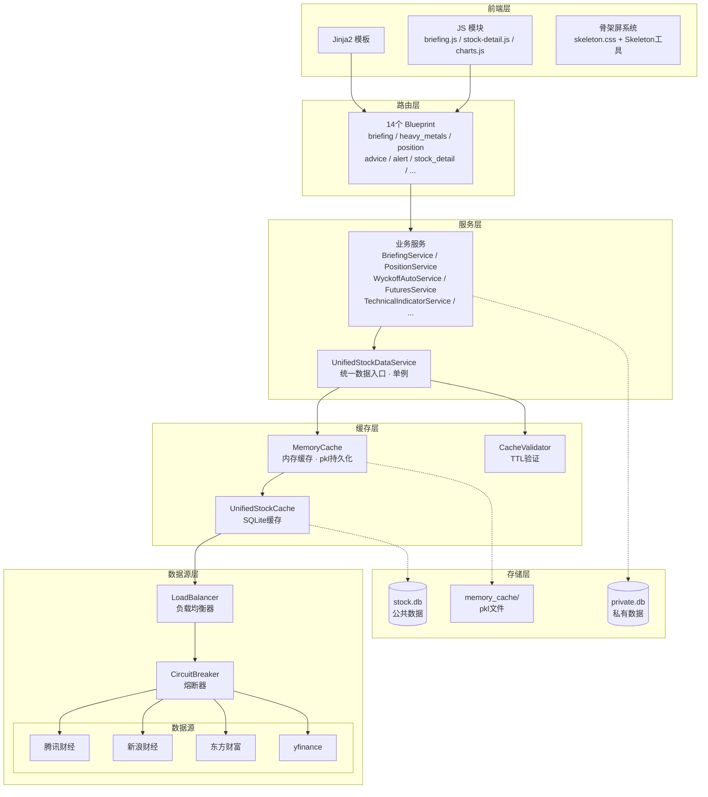
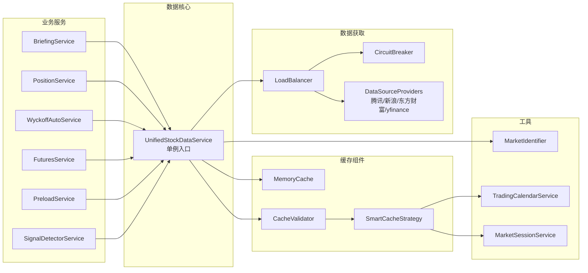

# 系统架构

## 分层架构

## 核心服务依赖

## 双库设计

| 数据库 | 用途 | 核心表 |
|--------|------|--------|
| `stock.db` | 公共数据，可共享 | Stock, Category, StockCategory, UnifiedStockCache, SignalCache, WyckoffAnalysis |
| `private.db` | 私有数据，不入Git | Position, Trade, Settlement, DailySnapshot, Advice, Config |

## 设计模式

| 模式 | 应用 |
|------|------|
| 单例 | UnifiedStockDataService, LoadBalancer, MemoryCache |
| 工厂 | Flask `create_app()` |
| 策略 | SmartCacheStrategy, BatchCacheStrategy |
| 熔断 | CircuitBreaker 监控数据源健康 |
