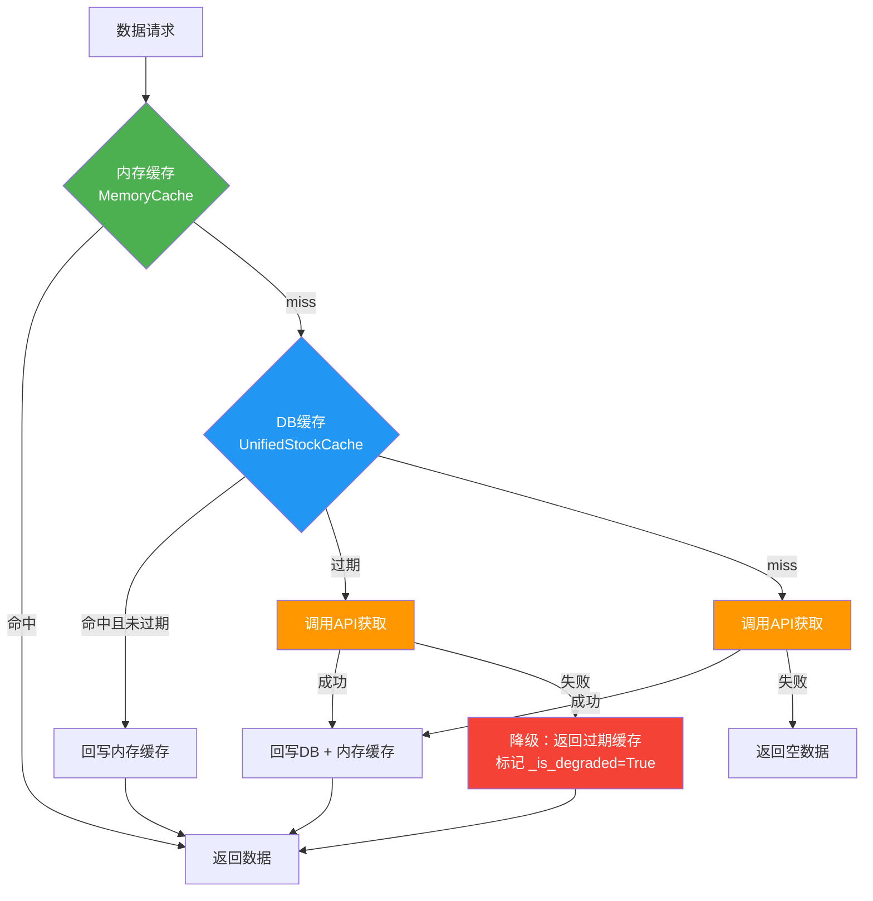
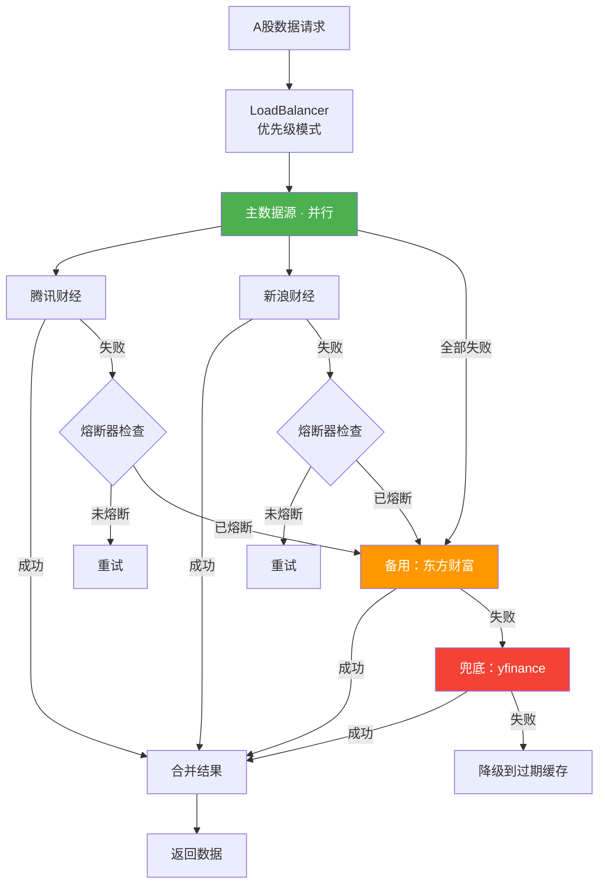
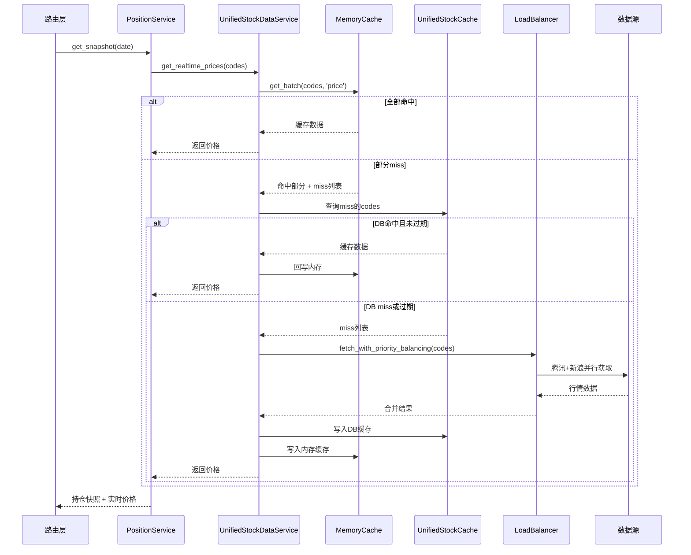

# 数据流与缓存架构

## 三层缓存流程



### TTL 策略

| 场景 | TTL | 说明 |
|------|-----|------|
| 交易时段内 | 30分钟 | 盘中数据持续变化 |
| 收盘后 | 次日开盘前 | 数据标记 `is_complete`，不再刷新 |
| 非交易日 | 下个交易日开盘前 | 周末/节假日复用收盘数据 |

### 内存缓存持久化

```
data/memory_cache/
├── 600519/          # 按股票代码分目录
│   ├── price.pkl
│   └── ohlc_30.pkl
├── AAPL/
│   ├── price.pkl
│   └── ohlc_60.pkl
└── ...
```

延迟 flush：变更后 5 秒批量写盘，启动时自动恢复。

## A股数据源负载均衡



### 熔断器参数

| 参数 | 值 |
|------|-----|
| 失败阈值 | 5次/分钟 |
| 熔断时长 | 5分钟 |
| 恢复 | 自动半开探测 |

### 数据源快照缓存

避免重复拉取全量行情，东方财富/新浪在实例级缓存全量快照：

| 快照Key | 内容 | TTL |
|---------|------|-----|
| `eastmoney_stock` | A股全量行情 | 2分钟 |
| `eastmoney_etf` | ETF全量行情 | 2分钟 |
| `sina_stock` | A股全量行情 | 2分钟 |

## 核心请求链路（实时价格获取）


